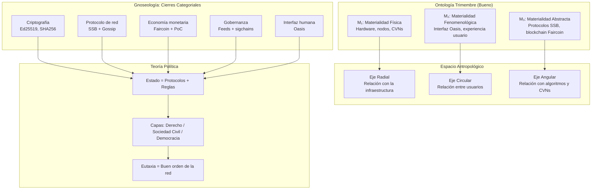

> **Nota (2026-09-09, rama `dev/clase`).** Draft semilla del modelo `clase` (materialismo filosófico de Gustavo Bueno). La rama se llama `dev/clase`, no `dev/materialismo`. Layout vigente: `modelos/clase/drafts/draftvN.md` (el sufijo mayor es el draft vigente) y `modelos/clase/revision/NN-*.md`; los ficheros `b0…b2` que propone el plan de abajo se escriben como `draftv0`, `draftv1`, … La rama solo toca `modelos/clase/`. Ver `llms.md`.

## 🌌 Panorámica del Sistema de Gustavo Bueno: El Materialismo Filosófico

El sistema de Gustavo Bueno (1924-2016) es uno de los proyectos filosóficos más ambiciosos y sistemáticos de la filosofía española del siglo XX. Lo llamó **Materialismo Filosófico**, y no es un materialismo vulgar o reduccionista, sino una **ontología, gnoseología, antropología y teoría política** articuladas en un todo coherente.

### 🧱 Los Tres Pilares del Sistema

#### 1. Ontología: Los Tres Géneros de Materialidad

Bueno rompe con el monismo materialista clásico (todo es materia física) y propone una ontología **trimembre**:

| Género | Descripción | Ejemplos |
|:---|:---|:---|
| **M₁ (Materialidad física)** | Cuerpos, cosas, procesos físicos y biológicos | Átomos, células, máquinas, redes de ordenadores |
| **M₂ (Materialidad fenomenológica)** | Vivencias internas, conciencia, experiencias subjetivas | Percepciones, emociones, pensamientos |
| **M₃ (Materialidad abstracta)** | Estructuras, relaciones, leyes, ideas objetivadas | Lenguaje, matemáticas, instituciones, sistemas normativos |

Estos tres géneros son **inconmensurables**: ninguno se reduce a los otros. La realidad es siempre una **involucración mutua** de los tres.

#### 2. Gnoseología: La Teoría del Cierre Categorial (TCC)

Es la teoría de la ciencia de Bueno. Su tesis central:

> **Una categoría es una totalidad atributiva en la que ha sido posible concatenar, por cierres operatorios, unas partes con otras**

En cristiano:
- Las **categorías** son los "recintos" o "círculos" donde se constituyen las ciencias particulares
- Una ciencia alcanza su **"cierre categorial"** cuando logra organizar autónomamente su campo de fenómenos
- **Categoría y ciencia positiva son prácticamente sinónimos**
- La filosofía es un **saber de segundo grado**: no trata directamente de la realidad, sino que **analiza, clasifica y coordina** los saberes de primer grado (ciencias, técnicas, políticas)

Bueno distingue dos órdenes de categorías:
- **Categorías del ser**: describen la realidad (física, biología, etc.)
- **Categorías del hacer**: implican fines intencionales (política, técnica, etc.)

#### 3. Espacio Antropológico: Los Tres Ejes

Bueno organiza la condición humana en tres ejes:

| Eje | Función | Contenido |
|:---|:---|:---|
| **Eje radial** | Relación con el mundo objetivo | Entidades impersonales, cosas, naturaleza |
| **Eje circular** | Relación entre sujetos humanos | Sujetos humanos, instrumentos, interacciones sociales |
| **Eje angular** | Relación con lo trascendente | Sujetos no humanos (dioses, animales, máquinas) con capacidad de conocimiento o apetición |

### 🏛️ La Teoría Política de Bueno

Bueno desarrolló una **teoría política materialista** con varios elementos clave:

- **El Estado como unidad de análisis central**: rechaza disolver el Estado en "sociedad civil" o "mercado"
- **Eutaxia como fundamento moral**: concepto que designa el **buen orden** o la **constitución justa** del cuerpo político
- **Crítica a la democracia formal**: Bueno no es un demócrata en el sentido convencional; analiza las **capas del Estado** (Estado de derecho, sociedad civil, democracia) como ideologías envolventes
- **Rechazo del estatuto científico de la ciencia política**: pero exige su **elaboración sistemática**

### ⚔️ Bueno vs. Trevijano vs. Colectivizaciones

| Dimensión | Bueno | Trevijano | Colectivizaciones 1936-37 |
|:---|:---|:---|:---|
| **Fundamento** | Materialismo ontológico | Republicanismo constitucional | Comunismo libertario |
| **Sujeto político** | Individuo en su materialidad corporal | Ciudadano como sujeto de derechos | Colectivo / clase obrera |
| **Economía** | No es el eje central; el Estado es lo primero | Propiedad privada como derecho | Colectivización de medios |
| **Ideología** | Crítica de las ideologías desde el materialismo | "Teoría Pura" = eliminar ideología | Ideología anarquista explícita |
| **Método** | Filosofía sistemática de segundo grado | Teoría constitucional | Revolución espontánea |

Bueno **no es ni anarquista ni republicano trevijaniano**. Su materialismo es una **tercera vía** que critica tanto el idealismo político como el economicismo marxista.

---

## 🛠️ Modelización con SolarNET.HuB + Ecosistema Faircoin

### Principio General

El materialismo filosófico de Bueno es una **filosofía de la mediación y la articulación**. No busca eliminar la complejidad, sino **organizarla sistemáticamente**. Por eso, una modelización con SNH + Faircoin no sería ni la "comuna digital" de las colectivizaciones ni la "república constitucional" de Trevijano, sino una **arquitectura que refleje la trimembración ontológica y la articulación categorial**.

---

### 🔷 Mapeo Ontológico: Los Tres Géneros de Materialidad en SNH + Faircoin

| Género Bueniano | Capa Tecnológica | Función en SNH + Faircoin |
|:---|:---|:---|
| **M₁ (Materialidad física)** | Hardware + nodos SNH + CVNs | Los servidores, ordenadores, discos duros, cables, energía que sostienen la red |
| **M₂ (Materialidad fenomenológica)** | Interfaz Oasis + experiencia de usuario | Las vivencias, percepciones, interacciones de los usuarios; el "mundo de la vida" digital |
| **M₃ (Materialidad abstracta)** | Protocolos SSB + blockchain Faircoin + código | Las estructuras lógicas, reglas, algoritmos, contratos inteligentes, sigchains |

**Principio bueniano aplicado**: Ninguna de estas capas se reduce a las otras. La red no es "solo hardware" (M₁), ni "solo experiencia" (M₂), ni "solo código" (M₃). Es la **involucración mutua** de las tres.

---

### 🔷 Mapeo Gnoseológico: La Teoría del Cierre Categorial

Bueno diría que **cada "categoría" o ciencia debe alcanzar su propio cierre**. En términos de SNH + Faircoin:

| Categoría / Ciencia | Cierre Categorial en SNH + Faircoin | Indicador de "cierre" |
|:---|:---|:---|
| **Criptografía** | Ed25519, SHA256, Secret Handshake【Wiki SNH】 | Algoritmos formalizados, estandarizados, auditables |
| **Protocolo de red** | SSB + Gossip protocol【Wiki SNH】 | Replicación consistente, resolución de conflictos |
| **Economía monetaria** | Faircoin + Proof-of-Cooperation【Faircoin PoC】 | Emisión controlada, consenso descentralizado |
| **Gobernanza comunitaria** | Feeds + sigchains + PUBs | Toma de decisiones trazable, revocable, asincrónica |
| **Interfaz humana** | Oasis (HTML+CSS puro, sin JS)【Wiki SNH】 | Usabilidad, seguridad, privacidad |

**Principio bueniano aplicado**: La filosofía (el "saber de segundo grado") consistiría en **analizar, clasificar y coordinar** estas categorías, identificando sus relaciones, solapamientos y tensiones. No se trata de imponer una "teoría unificada", sino de **mantener la tensión dialéctica** entre ellas.

---

### 🔷 Mapeo del Espacio Antropológico: Los Tres Ejes

| Eje Bueniano | Implementación en SNH + Faircoin |
|:---|:---|
| **Eje radial** (relación con el mundo objetivo) | La relación del usuario con la **infraestructura técnica**: nodos, blockchain, almacenamiento de datos. El "mundo" de la red |
| **Eje circular** (relación entre sujetos humanos) | La **red social** SSB: seguimientos, feeds, mensajes, interacciones entre usuarios. La comunidad |
| **Eje angular** (relación con lo trascendente no humano) | La relación con los **algoritmos, la IA, los CVNs** (nodos validadores cooperativos), que son "sujetos" no humanos con capacidad de proceso y decisión |

**Principio bueniano aplicado**: El "espacio antropológico" de la red no es plano. Hay **tres tipos de relaciones** que deben ser articuladas, no confundidas. La política de la red debe considerar las tres dimensiones.

---

### 🔷 Modelización Política: El Estado, la Eutaxia y las Capas

Bueno insiste en que el **Estado es la unidad de análisis central**. Pero en SNH + Faircoin no hay "Estado" en el sentido tradicional. ¿Cómo se modeliza?

| Concepto Bueniano | Traducción a SNH + Faircoin |
|:---|:---|
| **Estado** | El **conjunto de reglas y protocolos** que organizan la red: SSB, Faircoin, Oasis, las PUBs. Es la **constitución material** de la red |
| **Capas del Estado** | 1. **Estado de derecho**: el código fuente y los protocolos; 2. **Sociedad civil**: los usuarios y sus interacciones; 3. **Democracia**: los mecanismos de gobernanza (votaciones en SSB, asambleas) |
| **Eutaxia** | El **buen orden** de la red: que los protocolos funcionen, que los datos se repliquen, que las transacciones sean válidas, que los usuarios confíen. Es la **salud sistémica** |
| **Razón de Estado** | La **necesidad de mantener la red funcionando** incluso si eso implica decisiones centralizadas (como el nodo central de SNH) |

**Principio bueniano aplicado**: La red no es una "anarquía pura" ni una "democracia directa". Es una **estructura estratificada** con diferentes capas (código, protocolo, comunidad, gobernanza) que deben ser **coordinadas sistemáticamente**.

---

### 🔷 La Crítica Bueniana a las Otras Dos Modelizaciones

| Crítica | Colectivizaciones 1936-37 | República Pura (Trevijano) | Modelización Bueniana con SNH+Faircoin |
|:---|:---|:---|:---|
| **Al economicismo** | Reducen la política a la economía (colectivización de medios) | Trevijano critica el economicismo pero cae en el constitucionalismo formal | La red no es solo economía (Faircoin) ni solo código (SNH); es la **articulación** de ambas |
| **Al idealismo político** | Ideología anarquista como motor | "Teoría Pura" como eliminación de ideología = idealismo encubierto | El materialismo filosófico **no elimina la ideología, la critica materialmente** |
| **Al monismo** | Todo se resuelve en la colectividad | Todo se resuelve en la constitución | La red es **trimembre**: hardware, experiencia, código. Ninguna capa anula a las otras |
| **Al formalismo** | Asamblea como forma vacía | Constitución como forma vacía | Las **categorías** (SSB, Faircoin, Oasis) son **cierres operatorios**, no formas abstractas |

---

### 🗺️ Esquema Síntesis: La Arquitectura Trimembre de SNH + Faircoin según Bueno



---

## 📚 Chuletario de Referencias para el Agente

### Obras Fundamentales de Gustavo Bueno

| Obra | Descripción | Enlace / Localización |
|:---|:---|:---|
| *Ensayos materialistas* (1972) | Primera sistematización del materialismo filosófico | Buscar en bibliotecas / Fundación Gustavo Bueno |
| *Teoría del cierre categorial* (5 vols., 1992-1993) | Obra gnoseológica central | https://archive.org (buscar) |
| *¿Qué es la ciencia?* (1995) | Síntesis de su teoría de la ciencia | Editorial Pentalfa |
| *El animal divino* | Filosofía de la religión | Editorial Pentalfa |
| *Primer ensayo sobre las categorías de las "ciencias políticas"* | Teoría política materialista | https://archive.org |

### Fuentes Secundarias y de Contexto

| Recurso | Descripción | Enlace |
|:---|:---|:---|
| **Wikipedia - Materialismo filosófico** | Visión general del sistema | https://es.wikipedia.org/wiki/Materialismo_filosófico |
| **Enciclopedia Herder** | Criterios ontológicos del materialismo filosófico | https://encyclopaedia.herdereditorial.com |
| **Fundación Gustavo Bueno** | Web oficial con artículos y recursos | https://www.fgbueno.es |
| **Symploké** | Enciclopedia libre con entradas sobre Bueno | https://symploke.trujaman.org |
| **Dialnet - Tesis sobre teoría política** | Análisis de la filosofía política de Bueno | https://dialnet.unirioja.es |
| **Digibuo (Universidad de Oviedo)** | Archivo de documentos académicos | https://digibuo.uniovi.es |

### Conceptos Clave para el Agente

| Concepto | Definición | Fuente |
|:---|:---|:---|
| **Materialismo filosófico** | Sistema filosófico de Bueno; ontología trimembre + gnoseología del cierre categorial | Wikipedia |
| **Tres géneros de materialidad** | M₁ (físico), M₂ (fenomenológico), M₃ (abstracto) | Herder |
| **Teoría del cierre categorial** | Las ciencias se constituyen por "cierres" de sus campos categoriales | Documat |
| **Espacio antropológico** | Tres ejes: radial, circular, angular | Symploké |
| **Eutaxia** | "Buen orden" como fundamento moral de la política | Dialnet |
| **Filosofía como saber de segundo grado** | La filosofía analiza y coordina los saberes de primer grado | Digibuo |

---

## 💎 Nota para el Agente

El sistema de Bueno es el **más difícil de modelizar** de los tres porque:

1. **No es una ideología política** (como el anarquismo o el republicanismo), sino un **sistema filosófico total** que incluye ontología, gnoseología, antropología, ética y política.
2. **No prescribe** un modelo político concreto, sino que ofrece **herramientas críticas** para analizar cualquier modelo.
3. Su materialismo es **anti-reduccionista**: ninguna capa (ni la económica, ni la legal, ni la técnica) agota la realidad.

Por eso, la modelización con SNH + Faircoin no sería una "implementación del buenismo" (no existe tal cosa), sino un **ejercicio de "trituración"** de la arquitectura SNH+Faircoin con las coordenadas del materialismo filosófico.

Las preguntas que debe responder tu modelo son:

1. **¿Cómo se articulan las tres materialidades** (hardware, experiencia, código) en SNH+Faircoin?
2. **¿Qué "cierres categoriales"** se han alcanzado y cuáles están abiertos?
3. **¿Cómo se organiza el espacio antropológico** de la red (relaciones con las cosas, con los otros, con los algoritmos)?
4. **¿Cuál es la "eutaxia"** de esta red? ¿Qué la hace un "buen orden"?
5. **¿Qué capas del Estado** (derecho, sociedad civil, democracia) se pueden identificar?

---

# Plan: modelar el materialismo filosófico de Bueno sobre Oasis/SSB (rama propia, independiente)

## Contexto

`bueno-dev-7.md` es el chuletario para un tercer modelo: el **materialismo filosófico de Gustavo Bueno** sobre la misma infraestructura (Oasis/SSB @ `9a657b7`). El usuario pide un plan **independiente** de los otros dos (república de Trevijano en `dev/res_publica`, colectividades en `dev/colectividades`): no un contraste a tres, sino el modelo de Bueno por sí solo, con el mismo método de trabajo.

El propio chuletario lo advierte: Bueno **no prescribe** un modelo político; ofrece **coordenadas de análisis**. Eso obliga a adaptar el método. En res_publica el paso central es *criterio → código → veredicto Cumple/Falla → parche que repara*. Aquí no hay nada que «cumplir»: el producto es una **trituración** (término de Bueno para el análisis crítico) de Oasis con sus coordenadas, y la única norma que Bueno sí ofrece, la **eutaxia**, es la que puede convertirse en prueba de aceptación.

Estado del repo: cero commits; HEAD en `dev/res_publica` (no nacida); `bueno-dev-7.md` untracked; sin `.gitignore`. La rama para este modelo no está nombrada por el usuario: se propone **`dev/clase`** (a confirmar).

---

## 1. Lo que trae `bueno-dev-7.md` y lo que hay que corregir antes de usarlo

Es un resumen generado por un LLM, útil como índice de fuentes, con **errores doctrinales** que el carril D debe verificar. Grado de certeza según la escala de `draftv1` (A nuclear / B conocida sin verbatim / C reconstrucción del revisor):

| Afirmación del chuletario | Estado | Nota |
| :-- | :-- | :-- |
| Tres géneros de materialidad M1/M2/M3, inconmensurables, en *symploké* | **A** | Correcto. *Ensayos materialistas* (1972) |
| Teoría del cierre categorial; filosofía como saber de segundo grado; categorías del ser / del hacer | **A** | Correcto. *TCC* (1992-93), *¿Qué es la ciencia?* (1995) |
| Espacio antropológico: ejes radial, circular, angular | **A** | Correcto. El eje angular es la relación con **númenes** (animales, dioses); extenderlo a «máquinas/algoritmos» es lectura nuestra: **C** |
| «Capas del Estado: Estado de derecho, sociedad civil, democracia» | **Error** | No son las capas de Bueno. Las capas del **cuerpo político** son **conjuntiva, basal y cortical** (*Primer ensayo sobre las categorías de las ciencias políticas*, 1991). «Sociedad civil» es para Bueno un concepto ideológico a triturar, no una capa |
| «Eutaxia como fundamento moral» | **Impreciso** | Eutaxia = buen orden entendido como **capacidad de la sociedad política para persistir en el tiempo** (recurrencia), no un fundamento moral. **B** |
| «Sujeto político: individuo en su materialidad corporal» | **Error probable** | Bueno es antiindividualista: el sujeto es el cuerpo político y sus partes; el individuo aparece como resultado de la **holización**. **B** |
| «Razón de Estado → nodo central de SNH» | **Error técnico** | SSB no tiene nodo central. Heredado de la v1 de res_publica y ya desmentido en `draftv0 §1.1` |
| Faircoin PoC + «smart contracts» + Bank of the Commons | **Obsoleto** | Faircoin sin commits desde 2022-02-05 (`draftv0 §1.2`); Bitcoin 0.12 no tiene contratos. Se sustituye por ECOin + `Banking` |
| Diagrama mermaid: M1→radial, M2→circular, M3→angular | **Confusión de categorías** | Géneros de materialidad y ejes antropológicos son cortes distintos; Bueno no los identifica. Se descarta |
| Tabla «Bueno vs Trevijano vs Colectivizaciones» | Fuera de alcance | El usuario pide independencia |

Lo que falta en el chuletario y sí hace falta: las **nueve ramas del poder** (tres por capa), la **holización**, la crítica del **fundamentalismo democrático** (2010) y *Panfleto contra la democracia realmente existente* (2004), que es donde Bueno habla de democracia como forma y no como valor.

---

## 2. Método adaptado («la misma tecnología», con la diferencia que impone Bueno)

| Paso en res_publica | Equivalente aquí |
| :-- | :-- |
| 1. Corpus → criterios numerados con certeza | Corpus → **coordenadas** numeradas con certeza (no criterios normativos) |
| 2. Auditoría del código con fichero:línea | Igual. Se reutilizan los **hechos** de `draftv0 §2` y de las exploraciones de hoy; no se reutilizan sus veredictos |
| 3. Confrontación → Cumple/Falla | **Trituración** → para cada rama/coordenada: *implementada / ausente / fusionada / en manos del operador* |
| 4. Parches RP-n que «reparan» | Solo **parches de eutaxia** (`EU-n`): lo que aumenta la capacidad de la red para persistir. Bueno no manda nada más |
| 5. Backlog por carriles con defaults | Igual: carril D (fuentes de Bueno) → T (trituración) → EU (eutaxia) |
| 6. Revisión por capítulos | Revisión por **conceptos** (no hay un libro único): materialidades, cierre, espacio antropológico, cuerpo político, eutaxia, holización |

---

## 3. Coordenadas propuestas (para `b0 §1`; a validar en `revision/`)

| # | Coordenada | Fuente | Cert. |
| :-- | :-- | :-- | :-- |
| K1 | **Tres géneros de materialidad** (M1 físico, M2 fenomenológico, M3 abstracto) en symploké | *Ensayos materialistas* | A |
| K2 | **Cierre categorial**: qué capas de la red son ciencia cerrada, técnica abierta o dependencia externa | *TCC*, *¿Qué es la ciencia?* | A |
| K3 | **Espacio antropológico**: ejes radial, circular, angular | *Ensayos materialistas*, *El animal divino* | A (angular→IA: C) |
| K4 | **Capas del cuerpo político**: conjuntiva, basal, cortical | *Primer ensayo…* (1991) | B |
| K5 | **Nueve ramas del poder**: conjuntiva = ejecutiva, legislativa, judicial · basal = planificadora, redistribuidora, gestora · cortical = militar, diplomática, federativa | *Primer ensayo…* | B |
| K6 | **Eutaxia / distaxia**: buen orden como capacidad de recurrencia de la sociedad política | *Primer ensayo…* | B |
| K7 | **Holización**: reducción de la sociedad a partes homogéneas (ciudadanos iguales) como condición de la democracia; democracia como forma, no como valor | *El fundamentalismo democrático* (2010), *Panfleto…* (2004) | B |

---

## 4. Trituración preliminar (verificada hoy en el código; base de `b0 §2-3`)

### 4.1 K5 · Las nueve ramas contra Oasis — el producto central

| Capa | Rama | Módulo / seam | Estado | Quién la controla |
| :-- | :-- | :-- | :-- | :-- |
| Conjuntiva | Legislativa | `parliament_model.js` (constantes :17-26, `canPropose` :1298, `enactApprovedChanges` :1102) | Implementada | Voto del censo / gobierno del ciclo |
| Conjuntiva | Judicial | `courts_model.js` (métodos :139, `DICTATOR` :140-155) | Implementada; **fusionada** con la legislativa bajo `DICTATORSHIP` | Jueces electos / dictador |
| Conjuntiva | Ejecutiva | — | **Ausente**: nada se ejecuta, las leyes son texto en el log | Nadie |
| Basal | Planificadora | `industry_model.js` (blueprints :278-286, builds :755, `passesThreshold` :98) | Implementada | `steward` único (:163, :462) |
| Basal | Redistribuidora | `banking_model.js` RBU (:14-21, `computeEpoch` :920); tasa de carbono (:31-37) | Implementada; **autónoma** (epoch engine cada 30 min, `backend.js:10271`) | Nodo autodeclarado pub (`walletPub.pubId === ssb.id`, :215-221); constantes sin voto |
| Basal | Gestora | `market_model.js`, `shops_model.js`, `transfers_model.js`, `projects_model.js`, `wallet_model.js` | Implementada, sin escrow (`market:547`, `shops:712`, `projects:162`) | Autor del feed |
| Cortical | Militar (defensa) | `crypto.js` (AES-GCM :146, box :319), `caps.shs` en `server-config.json`, `friends.hops`, block (`backend.js:7306`), `panicmode_model.js:7` | Existe como **técnica**, no como poder político | **Operador del nodo** (fichero de config, loopback) |
| Cortical | Diplomática | `fediverse_model.js` (Multiverse: Mastodon/Telegram, cuenta única por nodo :87; rutas `backend.js:4651`, `:4669` sin guard) | Existe, **sin órgano** | Operador del nodo; cualquier petición no-loopback |
| Cortical | Federativa | `scripts/oasis-pub.js:41` (invites N usos), `snh-invite-code.json` (La Plaza), `autofollow.feeds`, `parentTribeId` (`tribes_model.js:11`) | Existe, **sin órgano** | Quien tiene shell en el PUB; el proyecto upstream (La Plaza viene de fábrica) |

**Hallazgo estructural**: Oasis politiza solo la capa conjuntiva (parlamento, tribunales) y una rama basal; **toda la capa cortical y los parámetros constitutivos de la basal** (constantes de carbono, `walletPub`, hops, caps) están en manos del **operador del nodo**, que no es una rama del cuerpo político sino un poder exterior a él. En términos de Bueno: la red tiene poderes sin ramas.

### 4.2 K6 · Indicadores de eutaxia/distaxia en el código

| Mecanismo | Seam | Lectura |
| :-- | :-- | :-- |
| Calendario fijo desde `TERM_EPOCH`; retorno a ANARCHY | `parliament_model.js:17-38`, `:373-393` | Eutaxia: recurrencia sin convocante |
| Rotación de claves de tribu al expulsar | `tribes_model.js:753` | Eutaxia: frontera de pertenencia que se repara sola |
| Export **sin** `secret`; onboarding marca `backup` sin exportar nada | `exportmode_model.js:24-26`, `onboarding_model.js:5`, `:118-124` | **Distaxia**: no hay camino de respaldo de identidad |
| Modo pánico borra `~/.ssb` con la clave | `panicmode_model.js:7`, `backend.js:8050` | Muerte voluntaria de la identidad sin confirmación |
| `POST /update` = `git reset --hard` sobre `src/configs/*.json` | `backend.js:9552-9561` | **Distaxia**: la actualización destruye la configuración local (caps, hops, wallet) |
| Sin métrica de uptime; almacenamiento y pares sí | `stats_model.js:438`, `:24` | La red no se mide a sí misma en el tiempo |
| Buckets verde/naranja/rojo de inhabitants | `inhabitants_model.js:65-73` | Única medida de recurrencia social |
| Tasa de carbono como único mecanismo de sostenibilidad a largo plazo | `banking_model.js:31-37` (0,095 g/MiB, sin cita) | Eutaxia ecológica con constante mágica |
| Epoch engine autónomo cada 30 min | `backend.js:10266-10271` | Redistribución sin humano: eutaxia o automatismo, a decidir en D |

### 4.3 K1 · Materialidades

- **M1**: bytes del feed (`banking_model.js:609-637`), `~/.ssb` (`stats_model.js:438`), CO₂. **M2**: opiniones (`opinions_model.js`), L.A.R.P., melodía. **M3**: constantes, tipos de mensaje, leyes.
- Hallazgo: `karmaScore = rawKarma − carbonGrams` (`banking_model.js:839-840`) **reduce M3 (peso político) a M1 (bytes)**. Es la única reducción entre géneros que la red ejecuta, y va contra la inconmensurabilidad de K1. Para Bueno no es materialismo: es fisicalismo.

### 4.4 K2 · Cierres

| Capa | Veredicto | Motivo |
| :-- | :-- | :-- |
| Criptografía (ed25519, secret handshake, AES-GCM) | Cerrada (importada) | Ciencia ajena, estandarizada |
| Replicación (EBT, hops) | Cerrada | Determinista, `SSB_server.js:61-73` |
| Gobernanza | Cerrada en el log, **abierta en la ejecución** | La derogación es tombstone de cliente (`draftv0 §2.1`); nada obliga fuera de la interfaz |
| Banca/RBU | **Dependiente** | RPC de una wallet externa en un solo nodo autodeclarado |
| IA «42» | Abierta | Llama-2-7B en puerto 4001 sin auth (`ai_service.mjs:89`); defensa contra inyección = regex (`:51`) |

### 4.5 K3 · Espacio antropológico

- Radial: infraestructura, bytes, carbono. Circular: follows, hops, tribus. **Angular**: la IA «42» (sujeto no humano que publica hasta 40 mensajes `log` por clic, `logs_model.js:235-270`), el calendario L.A.R.P. (año 10.000.000, `larp_model.js`), la esteganografía de `melody_model.js:124-146`. Lectura nuestra (C): Oasis tiene un eje angular poblado y sin gobernar.

### 4.6 K7 · Holización

- El log holiza: 1 feed = 1 inhabitant, censo por actividad (`inhabitants_model.js:86`). El karma **des-holiza**: reintroduce partes heterogéneas por notoriedad. Las tribus y las 9 casas re-agregan. Oasis es una sociedad que se holiza por el log y se re-estratifica por el karma. Material para D: ¿qué diría Bueno de una democracia cuyo demos se define por haber publicado?

---

## 5. Diseño de la rama

### 5.1 Supuestos (no bloqueantes)

- Rama **`dev/clase`** desde `dev/res_publica` (para tener `vendor/` y los hechos de `draftv0 §2` a mano). Se reutilizan hechos de código, nunca veredictos ni parches de las otras ramas.
- Documentos en carpeta **`modelos/clase/`**; `bueno-dev-7.md` queda en raíz como fuente, sin editar.
- Mismo commit `9a657b7`, misma escala A/B/C, mismas convenciones (fecha ISO, enlaces relativos con ancla, fichero:línea obligatorio).
- Sin contraste a tres. Si más adelante se quiere, será otro documento en otra rama.

### 5.2 Estructura

```
modelos/clase/
├── b0-trituracion.md      ≈ draftv0: coordenadas K1-K7 (§3), anatomía de la capa cortical y basal (§4), trituración por coordenada, parches EU-n, backlog
├── b1-nueve-ramas.md      producto central: tabla 4.1 en limpio, una fila por rama, con fichero:línea y «quién controla»; sustituye al «clon o parecido» (no hay modelo que clonar)
├── b2-backlog.md          ≈ draftv2: carriles D (fuentes de Bueno) → T (trituración) → EU (eutaxia)
└── revision/
    ├── 00-indice.md
    ├── 01-materialidades.md  02-cierre-categorial.md  03-espacio-antropologico.md
    ├── 04-cuerpo-politico.md (capas y nueve ramas)  05-eutaxia.md  06-holizacion-democracia.md
```

### 5.3 Carril D · investigación en fuentes (formato de `draftv2`: buscar · dónde · default · alternativas · desbloquea)

| ID | Buscar | Dónde | Default si no se investiga | Desbloquea |
| :-- | :-- | :-- | :-- | :-- |
| D01 | Nombres exactos y definición de las **nueve ramas**; si la ejecutiva es la «rama» o el «poder» | *Primer ensayo…* (1991) | Tabla K5 tal cual | T01, b1 |
| D02 | Definición de **eutaxia**: ¿duración, recurrencia, prudencia?; ¿es medible? | *Primer ensayo…* | Eutaxia = capacidad de recurrencia; indicadores de §4.2 | T05, EU-* |
| D03 | **Holización** y democracia como forma; crítica al «fundamentalismo democrático» | *El fundamentalismo democrático* (2010), *Panfleto…* (2004) | Holización por el log; karma como des-holización | T06 |
| D04 | Eje **angular**: ¿admite Bueno sujetos no humanos artificiales? | *El animal divino*, *Ensayos materialistas* | IA 42 y L.A.R.P. en el eje angular (C, marcado como extensión nuestra) | T03 |
| D05 | ¿Es la «gobernanza digital» una categoría del hacer con cierre posible, o una ideología? | *TCC*, *¿Qué es la ciencia?* | Técnica (categoría del hacer) sin cierre; solo la criptografía y la replicación están cerradas | T02 |
| D06 | Capa **cortical** y «imperio generador/depredador»: ¿aplica a puentes con otras redes (Mastodon, Telegram)? | *España frente a Europa* (1999) | Los puentes son diplomacia sin órgano; no se abre la cuestión imperial | T04 |
| D07 | Qué dice Bueno del **operador** de una institución (el que sostiene la capa basal sin ser parte formal) | *Primer ensayo…* | El operador es poder exterior al cuerpo político | T01, EU-1 |
| D08 | Rastreo de divulgación: fgbueno.es, *El Catoblepas*, Symploké; contraste con los libros | web | — | todas D |

### 5.4 Carril T · trituración (tareas de documento, una por coordenada)

T01 nueve ramas (b1) · T02 cierres · T03 espacio antropológico · T04 capa cortical completa (Multiverse, PUB, hops, panic, update) · T05 eutaxia con indicadores · T06 holización y karma · T07 materialidades y la reducción M3→M1 del karma.

### 5.5 Carril EU · parches de eutaxia (opcional; único lugar donde Bueno licencia prescribir)

| # | Parche | Seam | Qué persistencia repara |
| :-- | :-- | :-- | :-- |
| EU-1 | Órgano para la capa cortical: puentes Multiverse, invites del PUB y hops bajo decisión registrada en el log (no bajo shell) | `backend.js:4651`, `oasis-pub.js:41`, `server-config.json` | Poder sin rama → rama |
| EU-2 | Respaldo real de identidad: export con `secret` cifrado por passphrase; `backup` del onboarding verificado | `exportmode_model.js:24`, `onboarding_model.js:118` | Muerte de identidad por accidente |
| EU-3 | `POST /update` sin `git reset --hard` sobre `src/configs/`; token CSRF | `backend.js:9552` | Destrucción de config al actualizar |
| EU-4 | Métrica de uptime/recurrencia de la red en `stats` | `stats_model.js` | La red se mide en el tiempo |
| EU-5 | Constantes de carbono y de RBU como parámetros con procedencia y cambio registrado, no magia | `banking_model.js:31-37`, `:14-21` | Parámetros basales sin sujeto |
| EU-6 | Confirmación en dos pasos para modo pánico | `backend.js:8050` | Irreversibilidad sin fricción |

Decisión para el usuario: si el carril EU se hace o la rama se queda en trituración pura (D + T). Default: **se documenta EU, no se implementa**.

---

## 6. Pasos de ejecución (al salir de read-only)

1. Primer commit en `dev/res_publica` con `.gitignore` (`vendor/`) — hoy la rama no existe.
2. `git checkout -b dev/clase` (nombre a confirmar).
3. `modelos/clase/b0-trituracion.md` desde §1, §3 y §4 de este plan; cada fichero:línea verificado contra `vendor/oasis`.
4. `modelos/clase/b1-nueve-ramas.md` (tabla 4.1 en limpio, con columna de certeza de la rama y de la lectura).
5. `modelos/clase/b2-backlog.md` con D, T, EU.
6. `modelos/clase/revision/00-indice.md` y `01-materialidades.md` con el formato de `revision/01-lealtad.md`; seguir por conceptos.

## 7. Verificación

- Cada fichero:línea citado en `modelos/clase/*.md` existe en `vendor/oasis` y la línea contiene el símbolo nombrado (script de lectura, como en `draftv2 §Verificación`).
- Cada rama de `b1` tiene módulo o «ausente», estado y controlador; ninguna fila sin seam.
- Cada coordenada K1-K7 tiene ficha en `revision/` con certeza y al menos un hueco o un «sin hueco».
- IDs D01-08, T01-07, EU-1…6 únicos; todo «desbloquea» apunta a un ID existente.
- `git diff dev/res_publica..dev/clase` solo añade `modelos/clase/`; no toca `draft*.md`, `revision/`, `iberian-dev-7.md` ni `bueno-dev-7.md`.

## 8. Preguntas abiertas (no bloquean)

- Nombre de la rama: `dev/clase`, `dev/bueno`, otro.
- ¿Carril EU documentado solo, o también con tareas de código?
- ¿Se conserva la tabla «Bueno vs Trevijano vs Colectivizaciones» del chuletario como anexo, o se elimina por la independencia pedida? Default: se omite.
